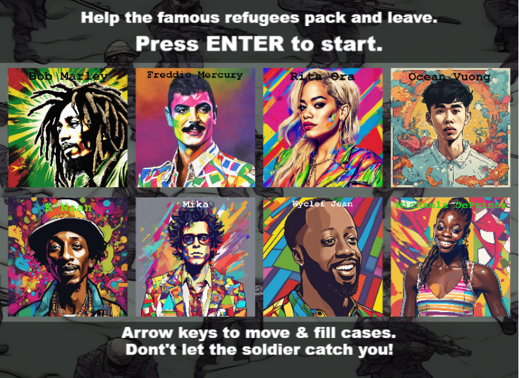
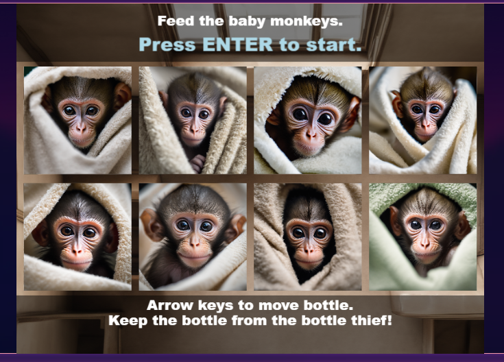

# Help famous refugees pack and leave
A short game to help 8 famous and celebrity refugees from different eras and countries pack their cases and leave, whilst also avoiding the enemy soldier.

## Link to deployed page: 
https://vickysug.github.io/help-famous-refugees-pack

## End mission:
Pack all the cases before the soldier gets you.

## Link to my storyborad on Canva: 
In progress

## Project Brief

This project was my 3rd project while on my internship with BIZGEES. The brief:

* Create a short 30 second - 2 minute game.

* Aimed at ages 18 - 25.

* To highlight celebrity and famous refugees.

* Be fun and engaging.

* Use AI to aid the creation.

## Famous refugee people I chose

Bob Marley, 
Freddie Mercury, 
Rita Ora, 
Gloria Estefan, 
Jerry Springer, 
Mika, 
Wyclef Jean, 
Albert Eienstein, 

## Technologies used

For the project the aim was to use AI, mainly Rosebud AI (https://play.rosebud.ai/home)

On the platform a developer can clone games created by other developers and change them for their own purpose. 

I chose to use a game called The Baby Monkey Saga, Evolved from: 2D Playground,
Created by: radio_biscuit

https://play.rosebud.ai/games/a5212c3f-fae8-407c-ab8f-4a8bddecb0cb

Rosebud can generate AI images an I created most of mine in Rosebud then added text over the top in photoshop. 

